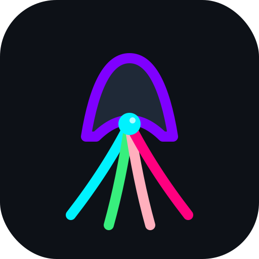
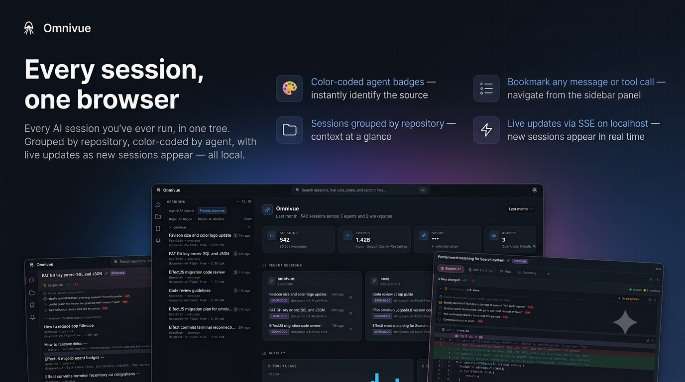

<p align="center">
  <picture>
    <source srcset="site/app_icon.svg" media="(prefers-color-scheme: dark)">
    
  </picture>
</p>
<h1 align="center">Omnivue</h1>
<p align="center">Session browser for OpenCode, Copilot, Cursor, Pi, Claude Code, and Codex.</p>
<p align="center">
  
</p>

<p align="center">
  
</p>

---

Omnivue is a 100% local session browser for your AI Agent Harnesses. It reads the session data already on your machine and shows it all in one place — conversation history, file diffs, implementation plans, and more.

## Features

- **Multi-agent support** — OpenCode, Copilot, Cursor, Pi, Claude Code, and Codex out of the box
- **Embedded terminal** — In-browser PTY that runs the agent's resume command (xterm.js + WebSocket)
- **Conversation viewer** — Full message history with tool calls, reasoning, and step events
- **File diffs** — Unified diff view of every file change made during a session
- **Plan tracking** — Implementation plans and checkpoints with status indicators
- **Live updates** — Adaptive SSE-based polling (5s when active, 30s when idle) with notification events
- **Full-text search** — FTS5 index across all session content, scoped or global
- **Notifications** — In-app toasts and OS notifications for new messages, questions, task completions, and status changes; configurable kinds, scope, quiet hours, and channels
- **Bookmarks** — Toggle bookmarks on any message or tool call; navigate from a sidebar panel
- **User folders** — Virtual organization with nesting, color, and icon support
- **Scratch notes** — Per-session markdown notes with rich text or code editor
- **Session renaming** — Override display names from the sidebar
- **Overview screen** — Analytics dashboard with session activity charts, model/agent breakdown, and time-range filtering
- **Settings UI** — Add/remove session sources from the browser
- **Resume sessions** — One-click copy of the CLI command to resume
- **Keyboard-driven** — `j`/`k` navigate, `⌘1`/`⌘2` tabs, `⌘F` search
- **Deep linking** — Shareable URLs `#/session/{id}/step/{n}`
- **Multi-theme** — Ayu, Nord, Catppuccino, Tokyo Night, and GitHub themes with light/dark modes
- **Read-only access** — Never writes to agent databases (enforced at driver level)
- **Single binary** — Go + embedded React SPA, zero runtime dependencies

## Local by Design

Omnivue keeps your workflow on your machine:

- **100% local** — Reads local session stores and writes only to its own local state database
- **No cloud sync** — Nothing is uploaded, indexed remotely, or sent to a hosted service
- **Read-only adapters** — Agent databases are opened in read-only mode and never modified
- **localhost UI** — The browser app runs against a local server on your machine

## Getting Started

### 1. Clone, build, and run (recommended)

Requires Go 1.26+, [Node.js](https://nodejs.org/) (for the frontend build), and [pnpm](https://pnpm.io/). Build from source avoids Gatekeeper issues on macOS.

```bash
git clone https://github.com/stevencrawford/omnivue.git
cd omnivue
make build
./omnivue --foreground --port 16275
```

### 2. Pre-built binary via curl

> **macOS note:** The binary is signed ad-hoc but not notarized. Gatekeeper may block the first launch — right-click in Finder and select **Open** to bypass, or use method 1 above to avoid this entirely.

**macOS (Apple Silicon)**
```bash
curl -fsSL https://github.com/stevencrawford/omnivue/releases/latest/download/omnivue_darwin_arm64.zip -o omnivue.zip && unzip omnivue.zip && rm omnivue.zip
```

**macOS (Intel)**
```bash
curl -fsSL https://github.com/stevencrawford/omnivue/releases/latest/download/omnivue_darwin_amd64.zip -o omnivue.zip && unzip omnivue.zip && rm omnivue.zip
```

**Linux (amd64)**
```bash
curl -fsSL https://github.com/stevencrawford/omnivue/releases/latest/download/omnivue_linux_amd64.tar.gz | tar xz
```

**Linux (arm64)**
```bash
curl -fsSL https://github.com/stevencrawford/omnivue/releases/latest/download/omnivue_linux_arm64.tar.gz | tar xz
```

**Windows (amd64)**
```bash
curl -fsSL https://github.com/stevencrawford/omnivue/releases/latest/download/omnivue_windows_amd64.tar.gz | tar xz
```

### 3. Download from GitHub Releases

> ⚠️ **Not recommended for macOS** — the binary is not notarized, so Gatekeeper will likely block even after manual download. Use method 1 (clone/make/run) instead.

Binaries and platform packages (.deb, .rpm) are on the [releases page](https://github.com/stevencrawford/omnivue/releases).

### Post-install

```console
$ ./omnivue init
$ ./omnivue
```

## Keyboard shortcuts

| Key | Action |
|-----|--------|
| `j` / `ArrowDown` | Select next session |
| `k` / `ArrowUp` | Select previous session |
| `⌘1` / `Ctrl+1` | Conversation tab |
| `⌘2` / `Ctrl+2` | Diff tab |
| `⌘F` / `Ctrl+F` or `⌘K` / `Ctrl+K` | Open search (scoped to active session) |
| `⌘B` / `Ctrl+B` | Toggle sidebar |
| `⌘D` / `Ctrl+D` | Toggle terminal panel |
| `Escape` | Close search / results |

## Documentation

For detailed documentation, API reference, adapter guide, and frontend overview, see the [docs/](docs/) directory.

## License

MIT License — see [LICENSE](LICENSE).
