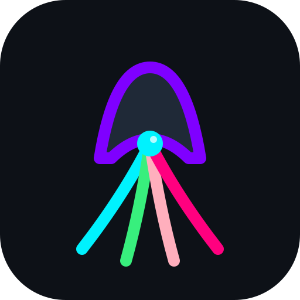
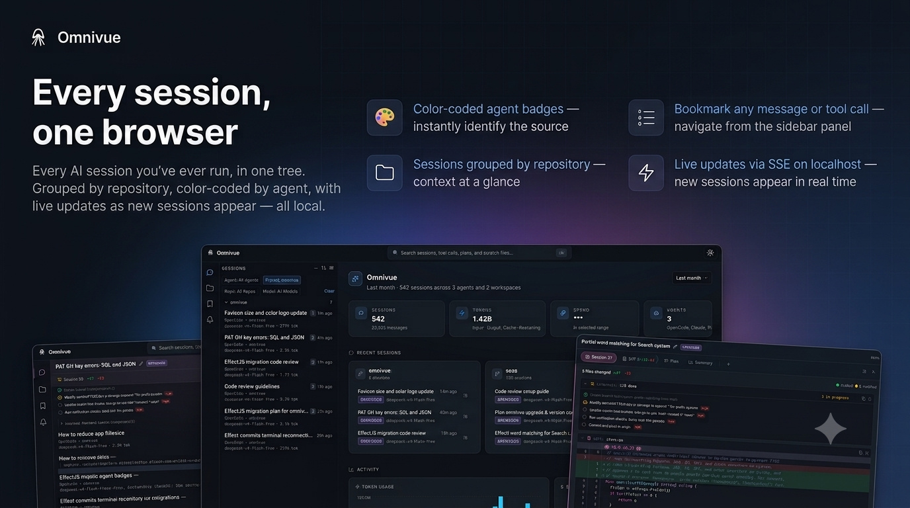

<p align="center">
  <picture>
    <source srcset="site/app_icon.svg" media="(prefers-color-scheme: dark)">
    
  </picture>
</p>
<h1 align="center">Omnivue</h1>
<p align="center">Multi-Agent Session Manager for OpenCode, Copilot, Cursor, Pi, Claude Code, and Codex.</p>
<p align="center">
  
</p>

<p align="center">
  
</p>

---

Omnivue is a 100% local multi-agent session manager for your AI coding sessions. It reads the session data already on your machine and presents it all in one place — conversation history, file diffs, implementation plans, and more.

## Features

- **Multi-agent support** — OpenCode, Copilot, Cursor, Pi, Claude Code, and Codex out of the box
- **Embedded terminal** — In-browser PTY that runs the agent's resume command (xterm.js + WebSocket)
- **Conversation viewer** — Full message history with tool calls, reasoning, and step events
- **File diffs** — Unified diff view of every file change made during a session
- **Plan tracking** — Implementation plans and checkpoints with status indicators
- **Todos** — Agent task ticker with live status tracking and dependency links
- **Prompt queue** — Queue prompts globally or per session, dispatch or delete from the sidebar
- **Cinematic view** — Full-screen session presentation with timeline scrubber, console, and file access tree
- **Session summary** — Per-session token/cost timelines and effectiveness analytics
- **Live updates** — Adaptive SSE-based polling (5s when active, 30s when idle) with notification events
- **Full-text search** — FTS5 index across all session content and tags, scoped or global
- **Notifications** — In-app toasts and OS notifications for new messages, questions, task completions, and status changes; configurable kinds, scope, and channels
- **Bookmarks** — Toggle bookmarks on any message or tool call; navigate from a sidebar panel
- **User tags** — Virtual organization with unique names, custom colors, and searchable grouping
- **Scratch notes** — Per-session markdown notes with rich text or code editor
- **Session renaming** — Override display names from the sidebar
- **Screenshot capture** — Export markdown screenshots of the conversation
- **Overview screen** — Analytics dashboard with session activity charts, model/agent breakdown, and time-range filtering
- **Settings UI** — Agent, sessions, notifications, appearance, privacy, developer, and about tabs
- **Resume sessions** — One-click copy of the CLI command to resume, or open an embedded terminal
- **Keyboard-driven** — `j`/`k` navigate, `⌘1`/`⌘2` tabs, `⌘K` search, `?` shortcuts reference
- **Deep linking** — Shareable URLs `#/session/{id}`
- **Multi-theme** — Ayu, Nord, Catppuccin, Tokyo Night, GitHub, One Monokai, Atom One, Dracula, and Night Owl themes with light/dark modes and high-contrast support
- **Read-only access** — Never writes to agent databases (enforced at driver level)
- **Single binary** — Go + embedded React SPA, zero runtime dependencies

## Local by Design

Omnivue keeps your workflow on your machine:

- **100% local** — Reads local session stores and writes only to its own local state database
- **No cloud sync** — Nothing is uploaded, indexed remotely, or sent to a hosted service
- **Read-only adapters** — Agent databases are opened in read-only mode and never modified
- **localhost UI** — The browser app runs against a local server on your machine

## Getting Started

### 1. Homebrew (macOS)

```sh
brew install stevencrawford/tap/omnivue
```

### 2. Build from source

Requires Go 1.26+, [Node.js](https://nodejs.org/), and [pnpm](https://pnpm.io/).

```bash
git clone https://github.com/stevencrawford/omnivue.git
cd omnivue
make build
./omnivue --foreground --port 16275
```

## Keyboard shortcuts

| Key | Action |
|-----|--------|
| `j` / `↓` | Select next session |
| `k` / `↑` | Select previous session |
| `⌘1` / `Ctrl+1` | Session tab |
| `⌘2` / `Ctrl+2` | Diff tab |
| `⌘K` / `Ctrl+K` | Open search palette (scoped to active session) |
| `↑` / `↓` | Navigate search results |
| `↵` | Open search result |
| `⌘↵` / `Ctrl+↵` | Open results drawer |
| `⌘B` / `Ctrl+B` | Toggle sidebar |
| `?` | Open shortcuts reference |
| `Escape` | Close search / drawer / modal, clear highlight |

## Documentation

For detailed documentation, API reference, adapter guide, and frontend overview, see the [docs/](docs/) directory.

## License

MIT License — see [LICENSE](LICENSE).
